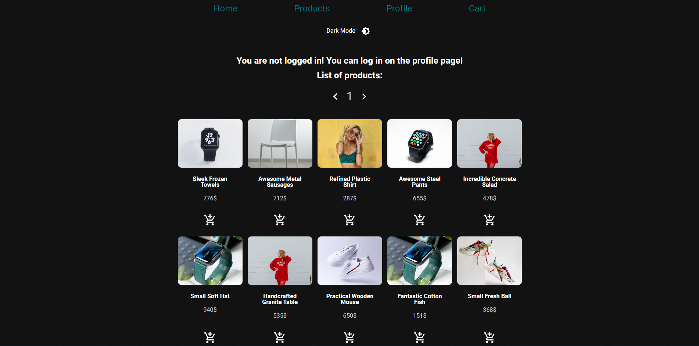

# Online Shop

'Online Shop' is a frontend project written with TypeScript, Material-UI, React and Redux. This is one of my frontend projects I have ever done!
The purpose of this project was to learn about building a frontend web application. I have also improved my skills with Material-UI, React and Redux.

[About](#about) •
[Demo](#demo) •
[Installation](#installation) •
[Author](#author) •
[License](#license)

## About

The project consists of:

- React.js (17+)
- React Router (6+)
- Redux (toolkit)
- Material-UI (5+)

Redux store has the following features:

- Product reducer: get all products, find a single products, update and delete a product (enabled only for the admin)
- User reducer: get all users, find a single user, create new user
- Cart reducer: add product to cart, remove products, update products's quantity in cart

## Demo

- Frontend: [Online Shop](https://online-store-project-sla686.netlify.app/) - (Test User profile: test@user.com / testuser)
- API endpoint used: [https://fakeapi.platzi.com/](https://fakeapi.platzi.com/)

## Installation

In the project directory, you can run:

### `npm install`

Install all the dependencies

### `npm start`

Runs the app in the development mode.\
Open [http://localhost:3000](http://localhost:3000) to view it in the browser.

The page will reload if you make edits.\
You will also see any lint errors in the console.

### `npm test`

Launches the test runner in the interactive watch mode

### `npm run build`

Builds the app for production to the `build` folder.\
It correctly bundles React in production mode and optimizes the build for the best performance.

## Author

- LinkedIn: [Viacheslav Semushin](https://www.linkedin.com/in/viacheslav-semushin/)
- Github: [@sla686](https://github.com/sla686)

## License

Copyright © 2022 [@sla686](https://github.com/sla686)  
